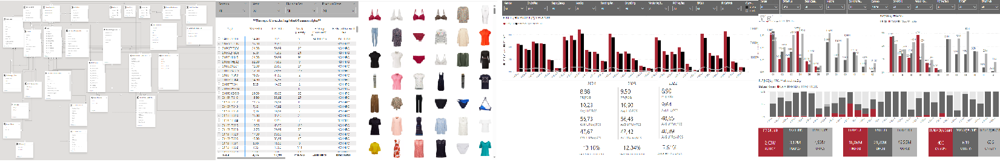
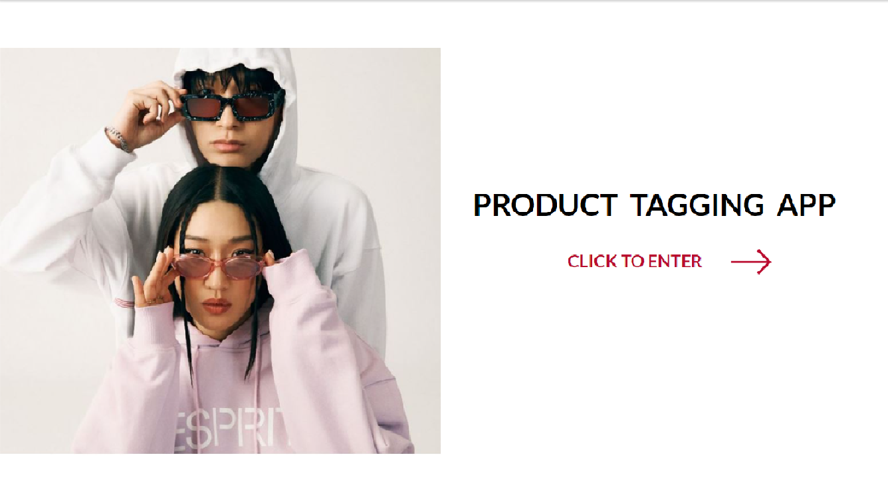
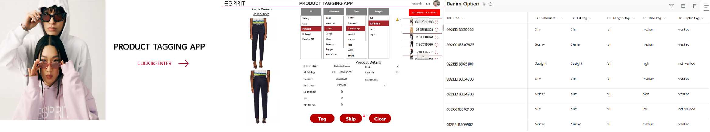
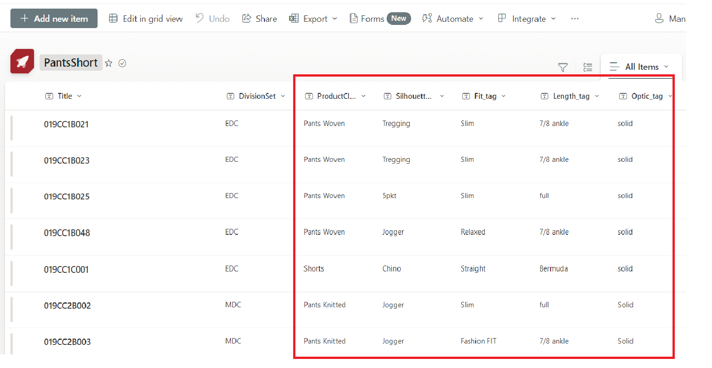

# SEBASTIEN HSU

## Summary
* Product Intelligence Analyst with 5 years of experience in processing and analysing large datasets; developed solid knowledge of retail business by coordinating projects across Buying, Merchandising, Allocation and Sourcing departments.
* Applied technical skills in as Power BI, Power Apps, SQL, and Python to solve cross-departmental issues.
* Enjoy working on my own initiative as well as collaborating with colleagues from different business functions on projects.

## SKILL
* SQL.
* Python.
* Microsoft Power Platform including Power-BI(DAX)/ Power-APPS(Power FX). Power Query.
* Microsoft Office.
* SAP(PE2/PE5/Analyzr).

## CERTIFICATIONS
* Microsoft Certified: Power Platform Fundamentals PL-900
* Google Data Analytics Certificate
* Microsoft Certified: Power BI Data Analyst Associate DA-100

## Project & Code Showcases - 

### PowerBI Reports/ Data Models/ Measures
[PowerBI Reports <--(for codes/measures)](https://sebsebsebsebtimes4.github.io/PowerBI-Reports/)

### PowerApp & Product Tagging Creation/Management

### SQL Archived

[SQL Archived Scripts](https://sebsebsebsebtimes4.github.io/SQL_Archived/)

### Python

### Machine Learning

