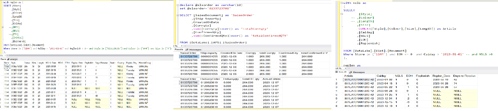

# SEBASTIEN HSU

## Summary
* Product Intelligence Analyst with 5 years of experience in processing and analysing large datasets; developed solid knowledge of retail business by coordinating projects across Buying, Merchandising, Allocation and Sourcing departments.
* Applied technical skills in as Power BI, Power Apps, SQL, and Python to solve cross-departmental issues.
* Enjoy working on my own initiative as well as collaborating with colleagues from different business functions on projects.

## SKILL
* SQL.
* Python.
* Microsoft Power Platform including Power-BI(DAX)/ Power-APPS(Power FX). Power Query.
* Microsoft Office.
* SAP(PE2/PE5/Analyzr).
* Tableau
* Google Cloud Storage & BigQuery
* Git&Github

## CERTIFICATIONS
* Microsoft Certified: Power Platform Fundamentals PL-900
* Google Data Analytics Certificate
* Microsoft Certified: Power BI Data Analyst Associate DA-100

## Project & Code Showcases - 

### 1. PowerBI Reports/ Data Models/ Measures
[PowerBI Reports <--(for codes/measures)](https://sebastien101.github.io/PowerBI-Reports/)

### 2. Using Python to connect with PowerBI Semantic Data Model
[Python PowerBI Connector](https://sebastien101.github.io/Python-for-BI-Semantic-Data-Model-Connector/)

### 3. PowerApps & Product Tagging Creation/Management
[PowerApps <--(for Apps/codes)](https://sebastien101.github.io/Power_Apps/)

### 4. Python
[Python Projects](https://sebastien101.github.io/Python/)

[Python Project_1 Stock Price API & Pythonanywhere & E-mail Notification](https://github.com/sebastien101/Python/blob/main/README.md#project_1)

### 5. SQL Archived
[SQL Archived Scripts <--(for SQL codes)](https://sebastien101.github.io/SQL_Archived/)

