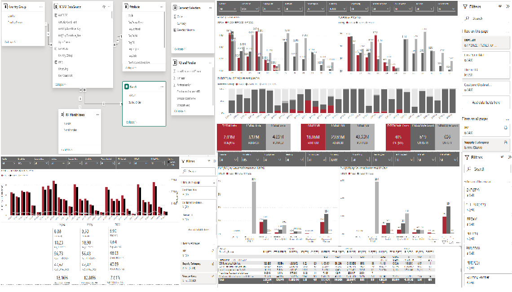

# SEBASTIEN HSU

## Summary
* Product Intelligence Analyst with 5 years of experience processing and analyzing large dataset; gained solid knowledge of retail business by coordinating projects in Buying, Merchandising, Allocation & Sourcing departments.
* Applied technical skills such as Power-BI, Power-Apps, SQL and Python to solve issues across departments.
* Enjoy working on my own initiative as well as cooperating projects with colleagues from different business functions

## CERTIFICATIONS
* Microsoft Certified: Power Platform Fundamentals PL-900
* Google Data Analytics Certificate
* Microsoft Certified: Power BI Data Analyst Associate DA-100

## SKILL
* SQL. Microsoft Power Platform including Power-BI(DAX)/ Power-APPS(Power FX). Power Query. Microsoft Office. SAP(PE2/PE5/Analyzr). Python.

## Project & Code Showcases - 

### PowerBI

### PowerApp

### Python

### Machine Learning

